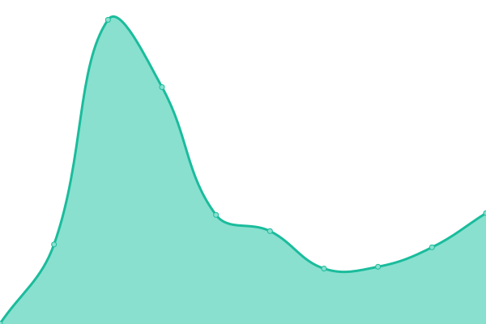
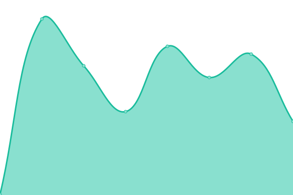

# [📈 Live Status](https://bellbella.github.io/uptime): <!--live status--> **🟥 Complete outage**

This repository contains the open-source uptime monitor and status page for [bellbella](https://bellbella.github.io/uptime), powered by [Upptime](https://github.com/upptime/upptime).

With [Upptime](https://upptime.js.org), you can get your own unlimited and free uptime monitor and status page, powered entirely by a GitHub repository. We use [Issues](https://github.com/bellbella/uptime/issues) as incident reports, [Actions](https://github.com/bellbella/uptime/actions) as uptime monitors, and [Pages](https://bellbella.github.io/uptime) for the status page.

<!--start: status pages-->
<!-- This summary is generated by Upptime (https://github.com/upptime/upptime) -->
<!-- Do not edit this manually, your changes will be overwritten -->
<!-- prettier-ignore -->
| URL | Status | History | Response Time | Uptime |
| --- | ------ | ------- | ------------- | ------ |
|  [BellBella](https://www.bellbella.com) | 🟥 Down | [bell-bella.yml](https://github.com/bellbella/uptime/commits/HEAD/history/bell-bella.yml) | 

 0ms
     
 | 

<a href="https://bellbella.github.io/uptime/history/bell-bella">0.00%</a>
    

|  [UserToken](https://www.usertoken.com) | 🟥 Down | [user-token.yml](https://github.com/bellbella/uptime/commits/HEAD/history/user-token.yml) | 

 0ms
     
 | 

<a href="https://bellbella.github.io/uptime/history/user-token">0.00%</a>
    

|  [PointLook](https://www.pointlook.com) | 🟥 Down | [point-look.yml](https://github.com/bellbella/uptime/commits/HEAD/history/point-look.yml) | 

 0ms
     
 | 

<a href="https://bellbella.github.io/uptime/history/point-look">0.00%</a>
    

<!--end: status pages-->

[**Visit our status website →**](https://bellbella.github.io/uptime)

## 📄 License

- Powered by: [Upptime](https://github.com/upptime/upptime)
- Code: [MIT](./LICENSE) © [bellbella](https://bellbella.github.io/uptime)
- Data in the `./history` directory: [Open Database License](https://opendatacommons.org/licenses/odbl/1-0/)
